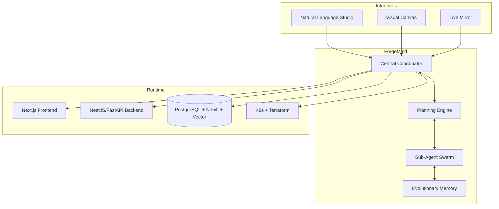

# AetherForge

**The Autonomous Full-Stack Software Factory**

> ⚠️ **Current Status: Foundation Phase** — This project is in active early development. The core ForgeMind autonomous agent, memory systems, and execution engine described below are **not yet implemented**. See [ROADMAP.md](./ROADMAP.md) and open issues for progress.

[](https://opensource.org/licenses/MIT)
[](https://github.com/kwizzlesurp10-ctrl/aetherforge-platform/stargazers)


**A production-grade, self-evolving full-stack platform where an embedded autonomous agent (ForgeMind) plans, builds, tests, deploys, and continuously improves the entire application — 24/7 in the background.**

Built for developers, startups, and enterprises who want AI that doesn’t just *assist* — it **owns** the entire software lifecycle.

---

## 🚦 Current Status

| Aspect                    | Status          | Notes |
|---------------------------|-----------------|-------|
| **ForgeMind Runtime**     | Not Started     | No background agent process or OODA loop yet |
| **Evolutionary Memory**   | Not Started     | No vector + graph memory bank implemented |
| **Planning Engine**       | Not Started     | No OODA / decision-making core |
| **Code Generation**       | Not Started     | No diff/PR creation logic |
| **GitHub Integration**    | Not Started     | No PR creation/review automation layer |
| **Sub-Agent Swarm**       | Not Started     | No orchestration implemented |
| **Self-Mutation**         | Not Started     | No safe self-improvement protocols |
| **Documentation**         | In Progress     | README clarified; ROADMAP.md added |
| **Infrastructure**        | Scaffold Only   | Basic CI (Node.js); no Docker, no polyglot deps |

**This is a high-ambition research platform.** Implementation will proceed in strict, verifiable phases with strong emphasis on safety, auditability, and incremental delivery.

---

## ✨ Vision & Core Features (Target)

- **ForgeMind Autonomous Agent** – Long-lived background process running hierarchical OODA loops. Plans, generates code, creates PRs, runs tests, deploys, and evolves the system autonomously.
- **Full-Stack Mastery** – End-to-end generation and maintenance of frontend, backend, data layer, infrastructure, CI/CD, and observability.
- **Advanced Agentic Architecture** – Dynamic sub-agent swarm, real-time Failure Heat Map, Evolutionary Memory Bank, and self-mutating protocols (MCP/A2A/ACP).
- **Multiple Operation Modes** – Natural language commands, visual planning canvas, or fully autonomous background evolution.
- **Enterprise Observability & Governance** – Complete provenance, audit trails, live system mirroring, and configurable human approval gates.
- **Self-Improving System** – Continuous learning from every decision and outcome.

## 🏗️ High-Level Architecture (Target)



## 🛠 Tech Stack (Target)

| Layer       | Technologies                              |
|-------------|-------------------------------------------|
| Frontend    | Next.js 15, React 19, TypeScript, Tailwind |
| Backend     | NestJS + FastAPI, Temporal.io             |
| Data        | PostgreSQL, Neo4j, pgvector, Redis        |
| Agents      | Custom MCP/A2A, Ray/Modal orchestration   |
| Infra       | Kubernetes, ArgoCD, Terraform             |
| Observability | OpenTelemetry, Grafana, Prometheus      |

## 🚀 Getting Started

> **Note:** This project does not yet have a runnable Getting Started experience. The repository is currently establishing its foundation.

```bash
# Clone the repository
git clone https://github.com/kwizzlesurp10-ctrl/aetherforge-platform.git
cd aetherforge-platform

# See ROADMAP.md for current priorities and how to contribute
cat ROADMAP.md
```

Detailed setup instructions will be added once the minimal viable core is stable.

## 🧠 ForgeMind in Action (Target Behavior)

ForgeMind will continuously:
1. Sense the current state of code, metrics, and goals.
2. Orient and critique using specialized agents.
3. Decide on plans with risk/ROI scoring.
4. Act by generating code, opening PRs, testing, and deploying.
5. Learn and mutate its own strategies safely.

## 🛡 Safety & Governance (Critical — In Design)

This project treats **agentic safety as a first-class concern**:
- Human-in-the-loop approval gates
- Dry-run / simulation modes
- Cost tracking and token budgeting
- Sandboxed code execution
- Full provenance and audit trails
- Hallucination detection and safe rollback
- Explicit self-mutation safety protocols

See upcoming governance design docs and issues.

## 🛡 License

This project is licensed under the MIT License - see the [LICENSE](LICENSE) file for details.

## 🤝 Contributing

We welcome contributions! Because this is an ambitious autonomous agent platform, we prioritize:

- Clear, incremental, well-tested changes
- Safety and auditability
- Alignment with the phased roadmap

**How to contribute:**
1. Review [ROADMAP.md](./ROADMAP.md)
2. Check open issues labeled `good first issue` or `area/documentation`
3. Open a discussion or PR with clear scope

ForgeMind may eventually assist with reviews, but all changes currently go through human maintainers.

---

*Maintained by the Elite Agent Agency. Building responsibly.*