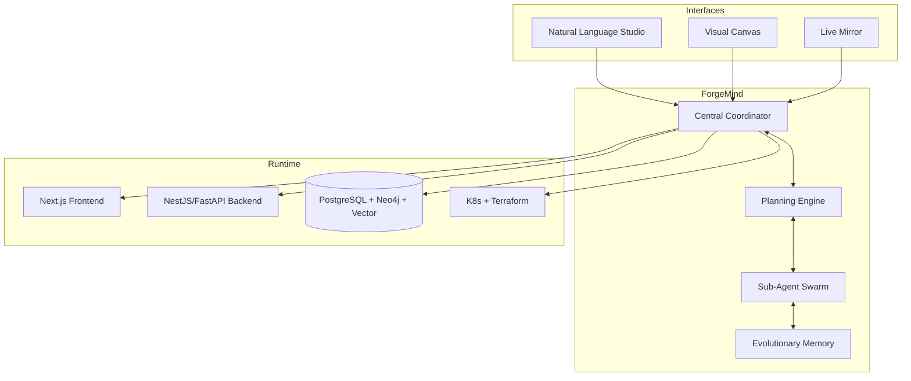

# AetherForge

**The Autonomous Full-Stack Software Factory**

[](https://opensource.org/licenses/MIT)
[](https://github.com/kwizzlesurp10-ctrl/aetherforge-platform/stargazers)

**A production-grade, self-evolving full-stack platform where an embedded autonomous agent (ForgeMind) plans, builds, tests, deploys, and continuously improves the entire application — 24/7 in the background.**

Built for developers, startups, and enterprises who want AI that doesn’t just *assist* — it **owns** the entire software lifecycle.

---

## ✨ Core Features

- **ForgeMind Autonomous Agent** – Long-lived background process running hierarchical OODA loops. Plans, generates code, creates PRs, runs tests, deploys, and evolves the system autonomously.
- **Full-Stack Mastery** – End-to-end generation and maintenance of frontend, backend, data layer, infrastructure, CI/CD, and observability.
- **Advanced Agentic Architecture** – Dynamic sub-agent swarm, real-time Failure Heat Map, Evolutionary Memory Bank, and self-mutating protocols (MCP/A2A/ACP).
- **Multiple Operation Modes** – Natural language commands, visual planning canvas, or fully autonomous background evolution.
- **Enterprise Observability & Governance** – Complete provenance, audit trails, live system mirroring, and configurable human approval gates.
- **Self-Improving System** – Continuous learning from every decision and outcome.

## 🏗️ High-Level Architecture



## 🛠 Tech Stack

| Layer       | Technologies                              |
|-------------|-------------------------------------------|
| Frontend    | Next.js 15, React 19, TypeScript, Tailwind |
| Backend     | NestJS + FastAPI, Temporal.io             |
| Data        | PostgreSQL, Neo4j, pgvector, Redis        |
| Agents      | Custom MCP/A2A, Ray/Modal orchestration   |
| Infra       | Kubernetes, ArgoCD, Terraform             |
| Observability | OpenTelemetry, Grafana, Prometheus      |

## 🚀 Getting Started

```bash
# Clone the repository
git clone https://github.com/kwizzlesurp10-ctrl/aetherforge-platform.git
cd aetherforge-platform

# Start the platform (Docker recommended)
docker compose up -d

# Access the studio at http://localhost:3000
```

See `docs/` or open issues for detailed setup.

## 🧠 ForgeMind in Action (Background Process)

ForgeMind continuously:
1. Senses the current state of code, metrics, and goals.
2. Orients and critiques using specialized agents.
3. Decides on plans with risk/ROI scoring.
4. Acts by generating code, opening PRs, testing, and deploying.
5. Learns and mutates its own strategies.

## 🛡 License

This project is licensed under the MIT License - see the [LICENSE](LICENSE) file for details.

## 🤝 Contributing

Contributions are welcome! Please open issues or PRs. ForgeMind may even review them autonomously.

---

*Maintained by the Elite Agent Agency. ForgeMind is always working in the background.*